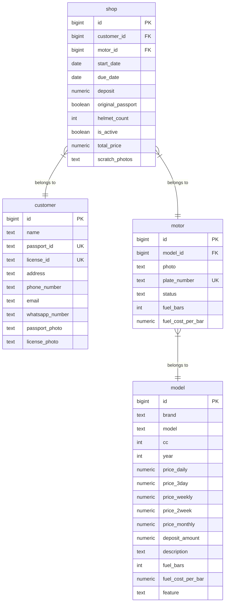

# CheapAsChip Scooter Rental App

CheapAsChip is a premium, feature-rich Android mobile application designed for scooter rental shops in Phuket, Thailand. Built using modern Android architecture, **Kotlin**, **Jetpack Compose**, and **Supabase**, it digitizes the entire rental lifecycle—from inventory management and contract signing to return inspection and real-time business reporting.

---

## 🎨 Key Features

1. **Color Psychology Accent Themes**: Customizes the user interface accents dynamically based on business moods and energy (Blue, Green, Purple, Yellow, Pink, Red, Black, Gray) matching color psychology trait definitions.
2. **Contract Wizard Flow**: A 5-step checkout flow that preserves form state when switching tabs, featuring:
   - **Google ML Kit OCR**: On-device offline passport scanning that auto-fills customer details.
   - **Full-Resolution Document Captures**: High-fidelity captures of passport, driver's license, and up to 8 scooter scratch photos.
   - **Interactive Signature Pad**: Clamped vector signature pad allowing customers to sign directly on the screen.
3. **Analytics & Performance Dashboard**:
   - Live metric tracking (Weekly/Monthly/Total Revenue, Rented/Available count).
   - Graphical Canvas Bar Charts with Weekly/Monthly toggle filters.
   - **Model Rent Reports**: Ranks model blueprint popularity with proportional progress bars, total days rented, and exact Thai Baht (฿) revenue.
4. **Automated Weekly & Monthly Business Reports**:
   - Interactive modal breakdowns of key business metrics.
   - Dynamic **PDF Report Exports** saved to the public Downloads folder with one-tap auto-opening.
5. **Interactive Scooter Return Inspections**:
   - 6-block visual fuel inspector matching each model's custom fuel capacity.
   - Automatic fuel charges calculations using scooter-specific fuel cost-per-bar rates.
6. **Due-Date Push Alarms**: Automatically schedules alarms 1 hour before contract expiry, triggering local status notifications.

---

## 🗄️ Database Schema & ER Diagram

The database runs on Supabase (PostgreSQL) with Row Level Security (RLS) enabled. The relations between the core tables (`customer`, `shop`, `motor`, `model`) are designed as follows:

### ER Diagram (Mermaid)



### Table Mappings

#### 1. `customer` Table
Stores information for customers checking in.
* `id` (bigint, PK, auto-identity)
* `name` (text, non-null)
* `passport_id` (text, unique, non-null)
* `license_id` (text, unique, non-null)
* `address` (text, hotel address details)
* `phone_number` (text)
* `email` (text)
* `whatsapp_number` (text)
* `passport_photo` (text, URI link to Supabase Storage bucket)
* `license_photo` (text, URI link to Supabase Storage bucket)

#### 2. `model` Table
Stores blueprint scooter models with default specifications and pricing tiers.
* `id` (bigint, PK, auto-identity)
* `brand` (text, e.g. "Honda")
* `model` (text, e.g. "PCX 160cc")
* `cc` (int, engine size)
* `year` (int)
* `price_daily` (numeric)
* `price_3day` (numeric)
* `price_weekly` (numeric)
* `price_2week` (numeric)
* `price_monthly` (numeric)
* `deposit_amount` (numeric, locked cash deposits)
* `description` (text)
* `fuel_bars` (int, custom capacity)
* `fuel_cost_per_bar` (numeric, default 100 THB)
* `feature` (text, comma-separated list of active specs, e.g. "Phone Charger,Keyless,ABS")

#### 3. `motor` Table
Stores specific physical bikes registered in the fleet.
* `id` (bigint, PK, auto-identity)
* `model_id` (bigint, FK referencing `model(id)`)
* `photo` (text, comma-separated list of photo URLs)
* `plate_number` (text, unique, non-null)
* `status` (text, "AVAILABLE" or "RENTED")
* `fuel_bars` (int)
* `fuel_cost_per_bar` (numeric)

#### 4. `shop` Table (Rental Contracts)
Tracks active and completed contracts.
* `id` (bigint, PK, auto-identity)
* `customer_id` (bigint, FK referencing `customer(id)`)
* `motor_id` (bigint, FK referencing `motor(id)`)
* `start_date` (date/timestamp)
* `due_date` (date/timestamp)
* `deposit` (numeric, deposit paid)
* `original_passport` (boolean, true if physical passport held in office)
* `helmet_count` (int, count of helmets given)
* `is_active` (boolean, true if currently rented)
* `total_price` (numeric, rent total cost)
* `scratch_photos` (text, comma-separated URLs of photos taken during checkout)

---

## 🛠️ Installation & Setup

1. **Clone the repository**:
   ```bash
   git clone https://github.com/tunowl/cheap-as-chips-app.git
   cd cheap-as-chips-app
   ```
2. **Build and Run the Android App**:
   - Open the folder in **Android Studio**.
   - Make sure your JDK is configured to Java 17+ (e.g. JetBrains Runtime/JBR).
   - Sync Gradle and run on an Android Device or Emulator.
3. **Database Configuration**:
   - Apply the schema in `supabase_schema.sql` directly into your Supabase SQL Editor.
   - Run the Python mock data seeder script under `scratch/seed_mock.py` to pre-populate models, vehicles, customers, and active rental history.
